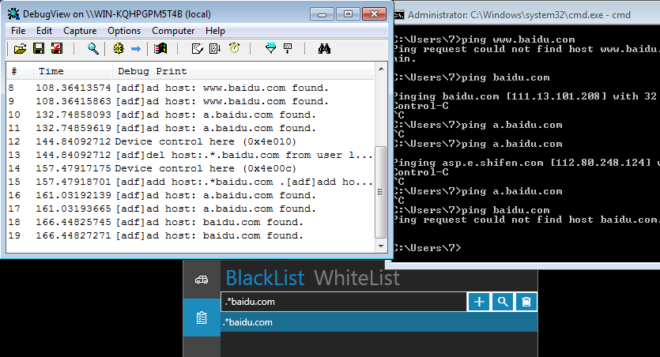

# ADFilter
Filter AD in windows kernel.

## How to use
just add host any you want to filter.

## How to build
To build driver and application, you need [Visual Studio 2013]() and [WDK8.1]() 
To build installer package, you need [nsis]().

This is repository contain those projects:
* [Tdi fw](./sys/tdi_fw)  
    A *kernel lib* implement the commuication with windows **TDI** Driver, 
    and provide a interface for handling network packet.
* [ADFilter driver](./sys/adfilter) 
    This is the driver we write for filter dns message in kernel.
* [ADFCon](./exe/adfcon) 
    This project provides a *C dll* for User Application access to the driver.
    (It also has a command line interface,but not recommended)
* [ADFilter application](./exe/adfilter) 
    This is a WPF application for control the driver.(make sure it has administrator privalge)
* [Installer](./installer) 
    You can use the nsis script use build a package for install and uninstall,for more information please see this [document](./installer/readme.md)

## Update
2017.7.29: 
* add a project to build nsis installer in visual studio.
* use Regular Expression [SLRE](https://github.com/cesanta/slre) replace the absolute compare.
